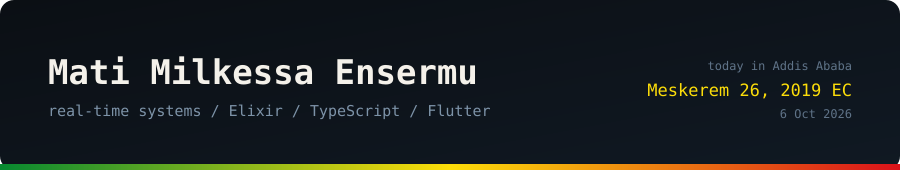

<p align="center">
  
</p>

```console
mati@addis:~$ whoami
software engineer. i like systems that have to be right while everything is moving.

mati@addis:~$ cat now.txt
- PolyHuntr: ranking 8,000+ live prediction markets by risk, executing copy-trades
- 18 scheduled jobs and a WebSocket firehose, all feeding one ETS cache
- mobile apps in Flutter, web in React + TypeScript, backends in Elixir

mati@addis:~$ cat languages.txt
አማርኛ  Afaan Oromoo  English
```

### Built

- **[PolyHuntr](https://polyhuntr.com/)** is a prediction-market trading platform on Phoenix LiveView. Markets stream in over WebSockets, Sharpe ratio, drawdown and freshness decide the ranking, and five sizing strategies drive copy-trades. I wrote the market-data layer.
- **Gazette Plus** is the Ethiopian Press Agency's news app. One Flutter codebase, Android and iOS, 5,000+ downloads.
- **[EAP](https://github.com/RealMati/EAP)** reads Ethiopian addresses, where Amharic and English mix in the same line, and checks the result against real subcity polygons with a hand-written point-in-polygon test.
- **Dispatch** is a courier portal for merchants, supervisors and admins, bilingual in English and Amharic, over Go microservices.
- **PDF2Quiz** turns a PDF into a quiz and ships as a single HTML file that works offline.

Most of it sits in private and organization repos, so the contribution graph undersells it.

### Background

BSc in Software Engineering at Addis Ababa University, finishing June 2026. Trained through [A2SV](https://www.a2sv.org), the Google-backed fellowship that sends engineers to Google, Bloomberg and Amazon. I use Claude Code daily and read every diff it writes.

### About the banner

Ethiopia has 13 months: twelve of 30 days and a short one of 5 or 6. The banner above is [rendered by a small script](scripts/hero.py) and a [GitHub Action](.github/workflows/hero.yml) that re-runs it at midnight Addis time, so it shows today's date in the Ethiopian calendar. It has no dependencies. I checked the conversion against known dates, including the leap-year 6th day of Pagume.

### Say hi

[matimilkessa@gmail.com](mailto:matimilkessa@gmail.com) · [LinkedIn](https://www.linkedin.com/in/mati-milkessa/) · [Ingenious Digital](https://ingeniousdigital.com)
